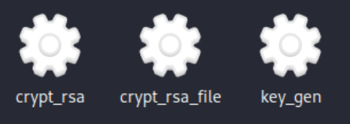

# Projet de Cryptographie

Ce document concerne le SAÉ (Situation d'Apprentissage et d'Évaluation) de cryptographie, à rendre à Denis Monnerat.

## Fonctionnalités Principales

Le projet vise à implémenter les fonctionnalités suivantes en cryptographie :

- **Génération de Clé RSA** : Créer une clé RSA $(n,e,d)$ avec une taille minimale de 1024 bits, bien que 2048 bits soit recommandé pour une meilleure sécurité.
- **Chiffrement et Déchiffrement d'un Entier** : Permettre le chiffrement et le déchiffrement d'un entier $m$, à condition que $m < n$.
- **Chiffrement et Déchiffrement de Fichiers** : Offrir la capacité de chiffrer et de déchiffrer des fichiers en utilisant la clé RSA générée.

## Utilisation du Makefile

Le Makefile fourni avec le projet facilite la compilation et la gestion des fichiers binaires. Voici comment l'utiliser :

### Compilation

Pour compiler le projet et générer les fichiers objet `.o` ainsi que les exécutables, exécutez :

```bash
make but
```
### Nettoyage des Fichiers de Compilation

Lorsque vous souhaitez nettoyer votre répertoire de travail en supprimant les fichiers intermédiaires et les exécutables, utilisez la commande suivante :

```bash
make clean
```


## Résultat Attendu après Exécution de `make but`

Après avoir exécuté la commande `make but`, vous devriez observer les résultats suivants dans votre environnement de développement. Cette capture d'écran illustre les fichiers et les exécutables qui seront générés et prêts à l'emploi :

<div align="center">
    
</div>

Cette visualisation vous aide à confirmer que les étapes de compilation se sont déroulées comme prévu et que les fichiers nécessaires à l'exécution de votre projet sont correctement créés.


### Optimisez votre Expérience

Pour une utilisation optimale et une compréhension approfondie des fonctionnalités, nous vous recommandons de consulter notre **Guide d'Utilisation**. 

Consultez le guide ici : [Guide d'Utilisation](./Guide_Utilisation/README.md)


### Accès à la Bibliothèque `big.c`

Pour plus de détails sur la bibliothèque `big.c` et accéder à l'ensemble des fonctionnalités qu'elle propose, consultez le dossier correspondant via le lien ci-dessous :

- [Accéder à la Bibliothèque](./lib)

### Consultation des Fichiers Objets

Les fichiers compilés `.o`, résultant de la commande de compilation, sont disponibles dans le dossier `build`. Vous pouvez les consulter pour vérifier les étapes de compilation ou pour des besoins de débogage :

- [Voir le Dossier `build`](./build)


